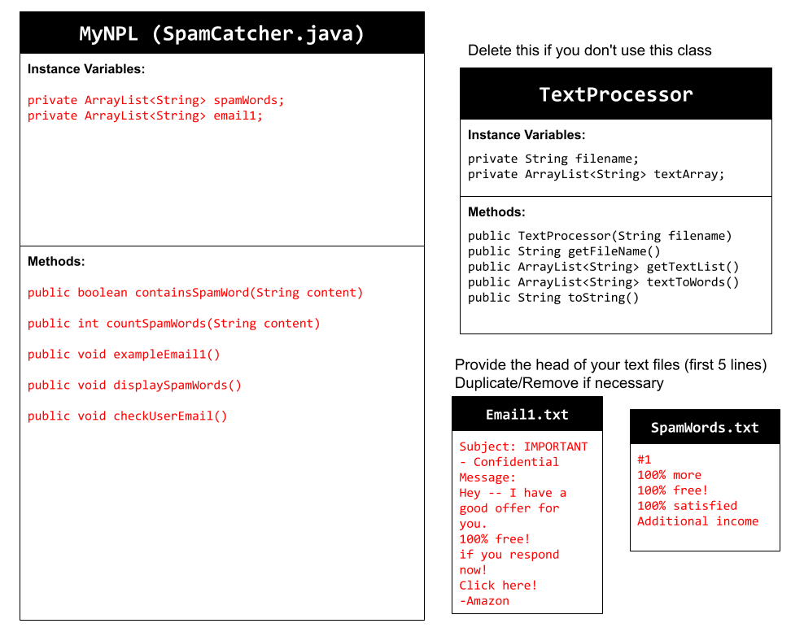

# Unit 6 - Natural Language Processing Project

## Introduction

Natural language processing (NLP) is used in many apps and devices to interact with users and make meaning of text to determine how to respond, find information, or to create new text. Your goal is to use natural language processing techniques to identify structure, patterns, and meaning in a text to have conversations with a user, execute commands, perform manipulations on the text, or generate new text.

## Requirements

Use your knowledge of object-oriented programming, ArrayLists, the String class, and algorithms to create a program that uses natural language processing techniques:

- **Create at least two ArrayLists** – Create at least two ArrayLists to store the data used in your program, such as data from text files or entered by the user.
- **Implement one or more algorithms** – Implement one or more algorithms that use loops and conditionals to find or manipulate elements in an ArrayList or String object.
- **Use methods in the String classs** - Use one or more methods in the String class in your program, such as to divide text into sentences or phrases.
- **Use at least one natural language processing technique** – Use a natural language processing technique to process, analyze, and/or generate text.
- **Document your code** – Use comments to explain the purpose of the methods and code segments and note any preconditions and postconditions.

## UML Diagram

Put and image of your UML Diagram here. Upload the image of your UML Diagram to your repository, then use the Markdown syntax to insert your image here. Make sure your image file name is one word, otherwise it might not properly get display on this README.

## Video

Record a short video of your project to display here on your README. You can do this by:

- Screen record your project running on Code.org.
- Upload that recording to YouTube.
- Take a thumbnail for your image.
- Upload the thumbnail image to your repo.
- Use the following markdown code:

)

If the thumbnail link doesn't work use this: https://youtu.be/psMpOFCVCxs

## Project Description

The problem that our application solved was the issue with spam in emails. Our program takes a user-inputted email and checks if it is a "spam" email by scanning the txt file of common spam words used in emails. It returns the number of spam words in the email and if it is safe or not. This may be helpful for those new to technology.

## NLP Techniques

The natural language techniques we implemented in our program was keyword spotting and frequency analysis to identify spam words and count the number of spam words in an email. The methods that are associated with this are containsSpamWord and checkUserEmail. The containsSpamWord method works by iterating through the spam words and if the email contains it, return true. Otherwise, return false. The checkUserEmail checks the email that the user inputs to the console, checking for spam keywords and returning how many words there are and if it is a safe email or not.